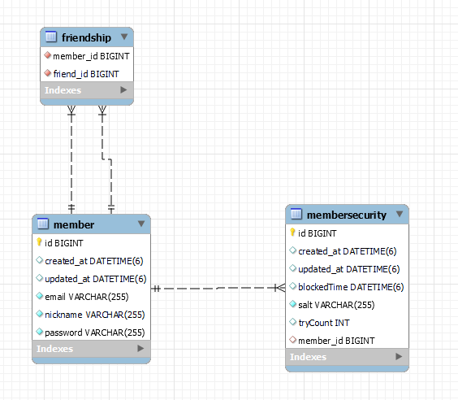
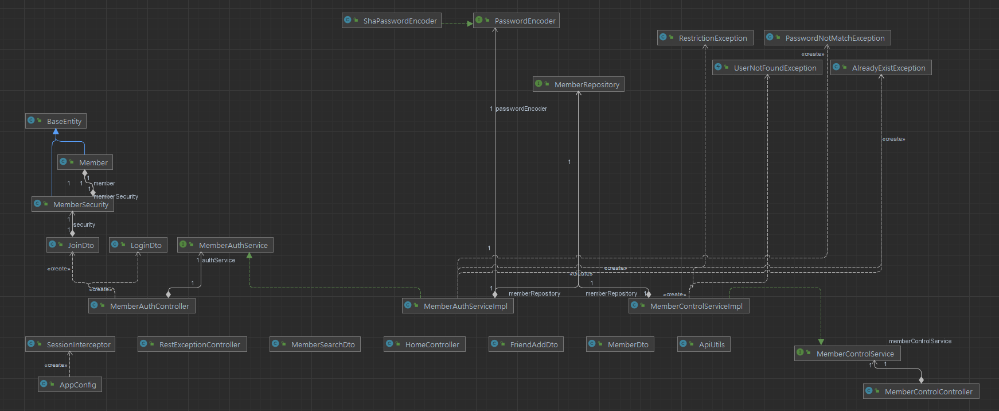

# 연습용 레포지토리

# Entity Relationship Diagram(현재까지)

- Member : 사용자의 정보를 저장하는 테이블

- MemberSecurity : 사용자의 보안 정보를 저장하는 테이블
  - blockedTime : 로그인 3회 시도시 block되는데, 해제되는 시간
  - salt : 비밀번호 암호화시 salt값
  - tryCount : 로그인 시도 횟수

- Friendship : 친구관계를 매핑하는 테이블
    
# Class Diagram (현재까지)

# 회원가입 Sequence

※ 회원가입 시 email 추가 인증을 구현할 예정 ※

1. 입력 값 validation
   - email : email형태여야하고 중복 불가
   - password & passwordCheck : 둘이 같아야함, 8자리이상, 20자리이하의 소문자,대문자,특수문자의 조합
   - nickname : 중복 불가
   - 공통적으로 NotBlank(공백 or null 안됨)
2. 입력받은 이메일 & 닉네임이 존재하는지 확인
3. SHA256 + SALT 알고리즘을 통해 비밀번호 암호화
4. 정보를 저장

# 로그인 Sequence

1. 입력 값 validation
   - email : email형태
   - 공통적으로 NotBlank(공백 or null 안됨)
2. 존재하는 계정인지 확인
   - 없으면 Throw Exception
   - 해당 계정이 현재 block상태면서, 시간이 지나지 않았다면 Throw Exception
3. 입력된 Password를 저장된 Salt를 이용하여 SHA256 암호화
4. 비교해서 맞으면 Session에 저장 및 로그인 성공
5. 틀리다면 Try Count를 1 증가시킨 뒤 로그인 실패
   - Try Count가 3이 되면 3분 block